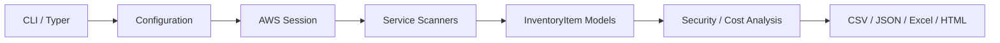

# AWS Inventory Pro

AWS Inventory Pro is a modular, production-oriented Python CLI designed to inventory AWS resources across regions, generate professional reports, and surface security and cost optimization findings.

## What this project provides

This starter implementation focuses on a clean architecture foundation that can be extended into a full enterprise-grade AWS inventory platform.

### Included capabilities
- AWS session creation and optional AssumeRole support
- Region-aware inventory workflows
- Typed inventory models for normalized resource data
- EC2 scanning as the first concrete service implementation
- Report export to CSV, JSON, Excel, and HTML
- Security and cost heuristics for common findings
- Unit tests and CI workflow scaffolding
- Docker-based packaging support

## Current scope

This repository is currently an EC2-first starter implementation. It is not yet a full inventory platform covering every AWS service. The codebase is structured so additional service scanners can be added in the same pattern, but at present the working example is EC2 discovery and reporting.

## Architecture overview

The application follows a layered structure:
- Core: shared models, configuration loading, and AWS session handling
- Scanners: service-specific discovery logic
- Exporters: report generation and file export
- Reports: security and cost analysis
- Tests: regression coverage for core behavior

A simple flow looks like this:



## Quick start

### 1. Install dependencies

```bash
pip install -r requirements.txt
```

### 2. Run a sample export

```bash
python inventory.py export --format csv --format json --format excel --format html
```

### 3. Scan with sample data

```bash
python inventory.py scan --sample
```

## Configuration

The project reads settings from [config.yaml](config.yaml). You can adjust:
- output directory for generated reports
- default AWS regions
- default profile name
- export format preferences

Example:

```yaml
default:
  output_dir: reports
  regions:
    - us-east-1
    - us-west-2
  profile: default
  max_workers: 8
  log_level: INFO
```

## CLI usage examples

```bash
# Generate sample inventory artifacts
python inventory.py export --format csv --format json --format excel --format html

# Scan AWS using the configured defaults
python inventory.py scan

# Run in sample mode without requiring live AWS credentials
python inventory.py scan --sample

# Scan a specific set of regions
python inventory.py scan --regions us-east-1 us-west-2
```

## Report outputs

The current exporter pipeline produces the following files in the reports directory:
- inventory.csv
- inventory.json
- inventory.xlsx
- inventory.html

## Security and cost analysis

The starter includes initial rule-based analyzers for common issues such as:
- public S3 buckets
- unattached EBS volumes
- inventory findings that can later be expanded into richer compliance checks

## IAM policy guidance

A minimum read-only policy example is available in [docs/iam-policy.json](docs/iam-policy.json).

## Project layout

- [core](core): shared models, configuration, and session helpers
- [scanners](scanners): AWS service scanners
- [exporters](exporters): CSV, JSON, Excel, and HTML export logic
- [reports](reports): security and cost analysis modules
- [tests](tests): unit tests for core behavior
- [docs](docs): documentation and policy examples

## Development workflow

```bash
pytest -q
```

## Notes

- The `core`, `scanners`, `exporters`, and `reports` directories are Python packages.
- If you add a new top-level module directory, include an `__init__.py` file so tests and imports work correctly.

## Roadmap

Planned expansion areas include:
- support for more AWS services and resource types
- richer security and compliance policies
- interactive dashboards and charts
- multi-account inventory collection
- enhanced Excel workbook formatting and multiple worksheets
- architecture relationship mapping and Mermaid/Graphviz output

## License

This project is distributed under the MIT License. See [LICENSE](LICENSE).
